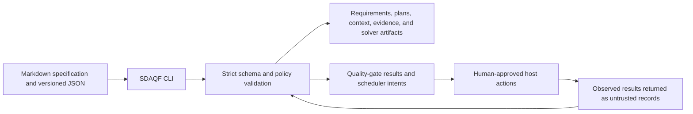

# SDAQF

[](https://github.com/guriguri215-lang/spec-driven-agent-framework/actions/workflows/ci.yml)

SDAQF is an offline-first Python CLI that turns Markdown specifications and
versioned JSON records into validated requirements, plans, evidence gates,
context snapshots, host-execution intents, and bounded finite-domain solver
results for Codex-assisted software projects.

> **Status: experimental reference implementation.** The
> [`v1.0.0-rc.1`](https://github.com/guriguri215-lang/spec-driven-agent-framework/releases/tag/v1.0.0-rc.1)
> prerelease contains the M0-M4 baseline. The current `main` branch adds the
> unreleased M5-M7 context, scheduling, and solver frameworks. Current CI
> verifies Windows and Linux on Python 3.12 and 3.13, but the project is not
> production-ready, macOS is not verified, and the current M5/M6
> implementations do not have a final independent GO review recorded in their
> execution plans.

## Why SDAQF

AI-assisted development can lose the connection between an original
specification, the plan produced from it, approvals for side effects, evidence
from implementation, and the state handed to another session. SDAQF makes
those boundaries explicit with strict schemas and deterministic local checks.

The intended users are framework evaluators and advanced Codex users who want
reviewable artifacts and fail-closed quality gates around an agent-assisted
workflow. It is not an autonomous coding product or an LLM runtime.

## What it does

| Capability | Current state | Evidence |
|---|---|---|
| Specification ingestion, requirement normalization, change comparison, plans, and prompts | Implemented | `src/sdaqf/application/requirements.py`, `planning.py`, M1 tests |
| Agent/tool registries, bounded role selection, approvals, checkpoints, and handoff contracts | Implemented | `src/sdaqf/application/orchestration.py`, `tooling.py`, M2/M3 tests |
| Claim-evidence, review, UI-observation, and local release-quality gates | Implemented | `src/sdaqf/application/quality_gates.py`, `release_qa.py`, M3 tests |
| Deterministic context indexing, selection, snapshots, and extractive compaction | Experimental | [Context Framework](docs/context-framework.md), M5 tests and validator |
| Durable SQLite scheduling, leases, mailboxes, budgets, recovery, and simulations | Experimental | [Multi-Agent Control Framework](docs/multi-agent-control-framework.md), M6 tests and validator |
| Exact-integer finite-domain feasibility and optimization with independent result verification | Experimental | [Mathematical Solver Framework](docs/mathematical-solver-framework.md), M7 tests and validator |
| Integrated end-to-end M8 workflow | Planned | [Roadmap](docs/roadmap.md) |

See [Implementation status](docs/implementation-status.md) for the detailed
milestone inventory, validation boundaries, and the distinction between code
presence and independent verification.

## What it does not do

- It does not call an LLM, the OpenAI API, the Agents SDK, or a hosted service.
- It does not launch Codex sessions, agents, browsers, or Git worktrees. It
  validates records and emits bounded instructions or intents for a host.
- It does not grant approvals, publish releases, push Git changes, or retry an
  ambiguous external effect automatically.
- It does not provide a web or desktop UI.
- It does not execute third-party solvers. The only executable solver is the
  dependency-free bounded reference adapter.
- It does not establish production security, correctness for arbitrary inputs,
  or general natural-language understanding.

## How it works



Responsibility is deliberately split:

| Actor | Responsibility |
|---|---|
| SDAQF's Python runtime | Deterministic parsing, validation, comparison, selection, state transitions, local simulation, and bounded reference solving |
| AI agent or LLM | Optional external proposal generation and implementation; its output remains untrusted input to SDAQF |
| Human or host | Approvals, session dispatch, worktree operations, browser observations, GitHub actions, publication, and other side effects |

The package is layered into domain records, application services, external
ports, local adapters, and the CLI. See [Architecture](docs/architecture.md)
for the complete flow and trust boundaries.

## Requirements

| Requirement | Supported state |
|---|---|
| Python | 3.12 or 3.13 |
| Operating systems | Windows and Linux verified in CI; macOS not verified |
| Runtime dependencies | None outside the Python standard library |
| Development tools | Exact versions in `requirements-dev.lock` |
| Git | Required by candidate-bound and repository-inspection operations |
| GitHub CLI and browser | Optional host capabilities; not required by the offline core |
| API keys, model provider, GPU, paid service | Not required |

The repository is distributed as source. There is no package-registry
publication or attached release asset.

## Quickstart

Clone the repository and create an isolated environment.

### Windows PowerShell

```powershell
git clone https://github.com/guriguri215-lang/spec-driven-agent-framework.git
cd spec-driven-agent-framework
py -3.12 -m venv .venv
.\.venv\Scripts\python -m pip --isolated install -r requirements-dev.lock
.\.venv\Scripts\python -m pip --isolated install --no-build-isolation --no-deps -e .
.\.venv\Scripts\python -m sdaqf validate examples/sample-project
```

### POSIX shell

```bash
git clone https://github.com/guriguri215-lang/spec-driven-agent-framework.git
cd spec-driven-agent-framework
python3.12 -m venv .venv
.venv/bin/python -m pip --isolated install -r requirements-dev.lock
.venv/bin/python -m pip --isolated install --no-build-isolation --no-deps -e .
.venv/bin/python -m sdaqf validate examples/sample-project
```

Expected result:

```text
valid: True
errors: []
files_checked: ['manifest.json', 'requirements.json', 'evidence.json', 'approval.json', 'execution-attempt.json', 'handoff.json', 'tool-registry.json', 'agent-registry.json']
```

Then inspect the available command groups:

```text
python -m sdaqf --help
```

## Minimal examples

### Turn a specification into a requirement baseline

The first command writes a new file and refuses to overwrite an existing one.

```text
python -m sdaqf ingest examples/sample-specification.md --output baseline.json
python -m sdaqf gate requirements baseline.json --json
```

### Plan bounded agent roles

This validates registries and returns assignments and host prompts. It does not
launch any agent.

```text
python -m sdaqf agents plan examples/m2-orchestration/orchestration-request.json --registry examples/m2-orchestration/agent-registry.json --tools examples/m2-orchestration/tool-registry.json --json
```

### Validate a context artifact

```text
python -m sdaqf context validate examples/m5-context/context-snapshot.json --json
```

The scheduler and solver require exact candidate, task, lease, budget, and
artifact identities. Use their complete guides rather than copying partial
commands:

- [Multi-Agent Control Framework](docs/multi-agent-control-framework.md)
- [Mathematical Solver Framework](docs/mathematical-solver-framework.md)

## Use cases

- Convert a bounded software specification into traceable requirement records,
  acceptance criteria, plans, and prompts.
- Validate agent/tool registries and prepare a deterministic host execution
  plan with explicit approval and reviewer-separation rules.
- Build reproducible, provenance-bound context selections and snapshots from
  explicit repository sources.
- Simulate and inspect host-agnostic multi-agent scheduling failure modes
  without launching agents.
- Solve and independently verify small exact-integer finite-domain feasibility
  or optimization requests with the reference adapter.

## Validation and evidence

The current repository contains positive, negative, boundary, corruption,
recovery, and CLI tests. Passing tests support only the documented contracts;
they do not prove production readiness or correctness outside the bounded
input models.

| Check | Current evidence |
|---|---|
| Automated tests | 1,111 passed and 4 platform-capability skips locally on 2026-08-03 |
| Current `main` CI | [Run 30816315795](https://github.com/guriguri215-lang/spec-driven-agent-framework/actions/runs/30816315795) passed on Windows/Linux and Python 3.12/3.13 |
| Static checks | Ruff and strict mypy are required by CI |
| Coverage | Total branch coverage must be at least 80%; critical M1, M2, M6, and M7 groups must be at least 90% |
| Named validators | M5 context integrity, M6 scheduler safety, and M7 solver evidence are exercised in the release contract |
| Independent review | Recorded for milestone candidates; the current M5/M6 plans still identify a final review gap |
| External validation | No independent production deployment, macOS run, hosted-agent evaluation, or third-party solver validation |

The exact local gate commands are in the
[Release Contract](docs/release-contract.md). Historical and milestone-specific
evidence is under `docs/evidence/` and `docs/exec-plans/`.

## Limitations

- The release is a prerelease and the post-RC M5-M7 changes on `main` are
  unreleased.
- The M6 scheduler provides durable state and host intents, not an agent
  runtime; delivery is at-least-once and exactly-once execution is not claimed.
- Context selection is deterministic lexical and graph retrieval, not semantic
  embedding search or model-based ranking.
- The reference solver enumerates bounded finite domains and is unsuitable for
  large or continuous problems. External solver entries are descriptive only.
- Model-generated, browser-generated, tool-generated, and solver-generated
  records remain untrusted until their applicable validators pass.
- Scalability is bounded by explicit input, byte, graph, scheduler, and solver
  limits; this repository does not publish throughput or latency guarantees.
- No security audit or independent production validation has been performed.
- APIs outside the documented CLI, JSON schemas, and `sdaqf.__all__` are
  internal and may change during the prerelease.

## Project structure

| Path | Purpose |
|---|---|
| `src/sdaqf/` | Runtime package and CLI |
| `schemas/` | Versioned public JSON schemas |
| `examples/` | Synthetic valid inputs and representative artifacts |
| `tests/` | Contract, boundary, regression, corruption, and CLI tests |
| `scripts/` | Release checks, audits, smoke tests, and named validators |
| `docs/` | Architecture, contracts, guides, evidence, and milestone plans |
| `evals/` | Bounded authored evaluation fixtures and results |
| `.agents/skills/` | Repository-local Codex skills |

## Documentation

- [Implementation status](docs/implementation-status.md)
- [Architecture](docs/architecture.md)
- [Public specification](docs/specification.md)
- [Roadmap](docs/roadmap.md)
- [Compatibility and migration](docs/compatibility.md)
- [Context Framework](docs/context-framework.md)
- [Multi-Agent Control Framework](docs/multi-agent-control-framework.md)
- [Mathematical Solver Framework](docs/mathematical-solver-framework.md)
- [Release Contract](docs/release-contract.md)
- [Dependency and license record](docs/dependencies.md)

## Roadmap

M0-M4 form the published release-candidate baseline. M5-M7 are implemented on
`main` with the validation qualifications above. M8, an integrated workflow
that composes the existing contracts without bypassing their validators, is
planned. See the [Roadmap](docs/roadmap.md) for scope, exclusions, risks, and
completion criteria.

## Contributing, security, and support

The repository is public, but external pull requests are not accepted during
the release-candidate phase. Bug and documentation issues are handled on a
best-effort basis. See [Contributing](CONTRIBUTING.md) and the
[Contributor Guide](docs/contributor-guide.md).

Do not disclose suspected vulnerabilities in public issues. Use GitHub private
vulnerability reporting as described in [Security](SECURITY.md). Support has
no SLA; see [Support](SUPPORT.md).

## License

SDAQF is licensed under Apache License 2.0. Copyright 2026
`guriguri215-lang`. See [LICENSE](LICENSE) and [NOTICE](NOTICE).
